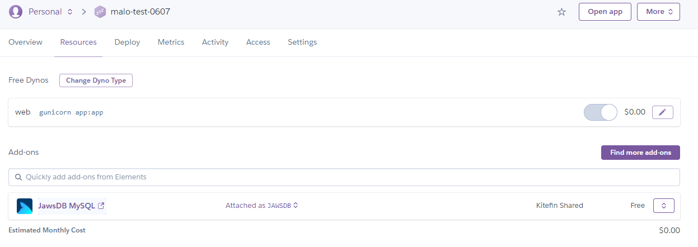

## Day03

### 前言
- 前面沒有參與的零基礎學員可以[這邊回顧](https://github.com/maloyang/khpy_flask_tutorial_20220524)
- 有Python基礎，想要了解Flask如何使用，並佈署上雲端平台可以[回顧這篇](https://github.com/maloyang/khpy_flask_tutorial_20220524/tree/main/Day02)

----
### 建立MySQL資料庫
- 我們先以Heroku建立MySQL來加快我們的進度
- 在Resources分頁，可以查找到mysql的Add-ons，並進行安裝
- 
- 
- 
- 成功產生一個MySQL資料庫，如下圖
- 
- 在Settings分頁這邊可以查到連結資料庫的資訊
- 
- 
- 我們使用DBeaver來連結，並測試MySQL資料庫
- 
- 
- 

----
### flask使用sqlalchemy連接MySQL
- 承接上星期的demo_07，我們需要修改程式如`demo_03_01`
- 因為加入了一些新的module，所以在requestment中也加入如下：
```
flask
gunicorn
requests
sqlalchemy
pymysql
```
- 主要新增的程式碼為
```python
@app.route('/score/insert', methods=['GET', 'POST'])
def score_insert():
    try:
        name = request.args.get('name')
        if not name:
            return jsonify({'result':'NG', 'log':'not name parameter'})

        score = request.args.get('score')
        if not name:
            return jsonify({'result':'NG', 'log':'not score parameter'})

        sql_cmd_str = "insert into table1 (name, score) values('%s', '%s') " %(
            name, score )

        resultProxy = my_db.execute(sql_cmd_str)
        return jsonify({'result':'OK', 'log': 'insert:(%s, %s)' %(name, score)})

    except Exception as e:
        print('--> exception: ' + str(e))
        return jsonify({'result':'NG', 'log':str(e)})
```

----
### 把寫入的資料讀出來
- 新增API如下
```python
@app.route('/score', methods=['GET'])
def score_get():
    try:
        sql_cmd_str = "select * from table1"
        resultProxy = my_db.execute(sql_cmd_str)
        db_data_all = resultProxy.fetchall()
        my_data = dict()
        for item in db_data_all:
            name = item['name']
            score = item['score']
            my_data[name] = score

        return jsonify({'result':'OK', 'data':my_data})

    except Exception as e:
        print('--> exception: ' + str(e))
        return jsonify({'result':'NG', 'log':str(e)})
```

----
### 在網頁上顯示API的資訊
- html的基本框架
- 網頁的Title
```
<title>一年一班成績清單</title>
```

- 加入要引用的javascript函式庫
```html
<script src="/static/js/jquery-3.4.1.min.js"></script>
```

- 加入css的樣式
```html
        <style>
          table, th, td {
            border: 1px solid black;
          }
        </style>
```

- 加入表格
```html
        <table>
            <thead>
              <tr>
                <th>名字</th>
                <th>分數</th>
              </tr>
            </thead>
            <tbody id="table_body">
              <tr>
                  <td id="name1"></td>
                  <td id="score1"></td>
              </tr>

              <tr>
                  <td id="name2"></td>
                  <td id="score2"></td>
              </tr>

            </tbody>
          </table>
```

- 撰寫javascript的程式
```html
        <script type="text/javascript">
        
            function load_data()
            {
                //...
            }
        
        </script>

```

- 讓html都載入後，再執行我們的程式
```html
        <script type="text/javascript">
            $( document ).ready(function() {

                load_data();
                
            });
        </script>    
```

